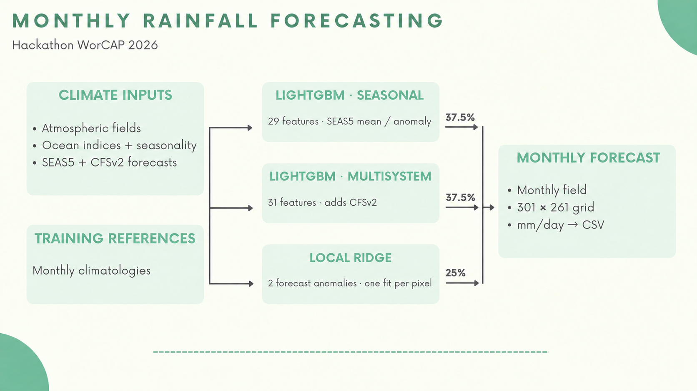
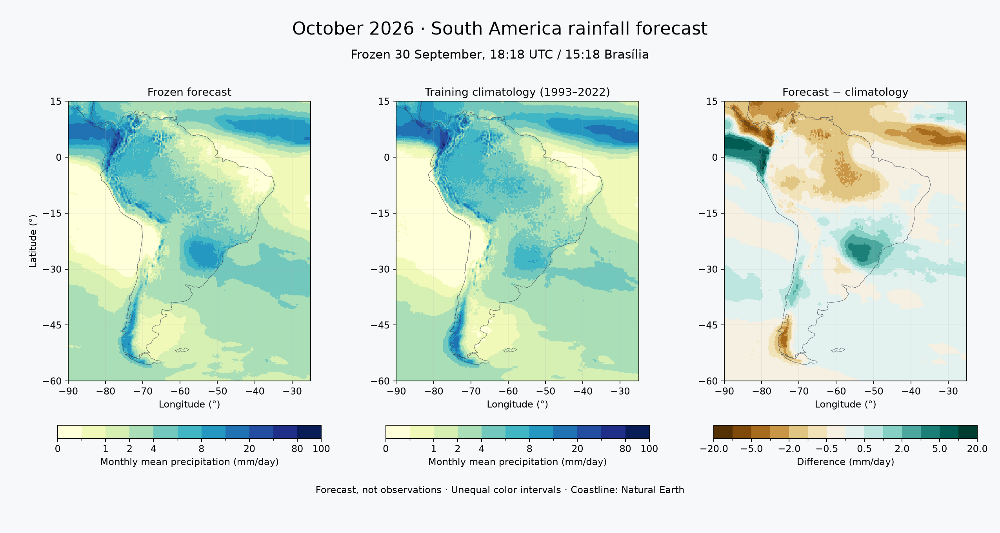

# 🌎 WorCAP 2026 · Rainfall Forecasting

Monthly rainfall forecasting over South America, combining seasonal climate forecasts, gradient boosting, and local ridge regression.

This project started during the **WorCAP 2026 Hackathon**, where it finished in the **Top 10**. The model in question documented here scored **1.78758 in the 2024 evaluation**.

After the competition, I decided to keep working on it. This repository brings together the submitted model, an explanation of how it works, and the experiments I’m developing now.

## 🏁 Start here

The competition solution and the model I'm developing now are both here. I kept the submitted version separate so it can still be reproduced while the research continues.

| What would you like to do? | Where to start |
|---|---|
| **Explore the results** | [Open the offline demo](demo/README.md): competition results and the current model, with saved maps and yearly metrics. No credentials or training. |
| **Reproduce an experiment** | [Follow the reproduction guide](docs/REPRODUCTION.md): choose the competition model or a new research comparison, check the inputs, then run. |
| **Run a monthly forecast** | [Use the operational guide](docs/MONTHLY_FORECAST.md): fit or restore the current model, collect sources, check readiness and freeze a forecast. |

For a quick look, download the repository ZIP, extract it and open `demo/index.html` in a browser. The two tabs distinguish the submitted model from the current reference. October's forecast is still marked as **not yet evaluated**.

Full runs need the [documented datasets](docs/DATA.md#availability), which are not all included in Git. [Start here](docs/GETTING_STARTED.md) explains what is available and what needs to be prepared.

## 📝 About the project

The goal is to predict monthly rainfall patterns across South America using atmospheric data, ocean indices, and seasonal climate forecasts.

The model predicts **monthly mean daily precipitation, in mm/day**, on a 0.25° grid. A monthly climatology provides the reference, and the models estimate how much rainfall might differ from those usual conditions.

For the competition, I combined three components:

| Component | Main inputs | Final weight |
|---|---|---:|
| LightGBM · seasonal | Atmospheric variables, ocean indices, location, seasonality, and SEAS5 | 37.5% |
| LightGBM · multisystem | The same inputs, with CFSv2 added | 37.5% |
| Local ridge regression | SEAS5 and CFSv2 forecast anomalies at each grid point | 25% |

Training uses up to 30 years of data, with climatologies and transformations fitted within each training window.

The [competition notebook](competition/hybrid_forecast.ipynb) explains the full process, from loading the data to generating the final CSV.

## 💾 Technologies

- Python
- NumPy
- pandas
- xarray
- LightGBM
- scikit-learn
- Matplotlib
- NetCDF/GRIB
- Kaggle

## 🛠️ How I built it

The starting point was a model based on rainfall climatology. From there, I gradually added atmospheric and ocean information. Seasonal forecasts provided another way to represent the conditions expected for each target month.

Forecast anomalies became an important part of the model. These describe how much a prediction differs from the usual conditions for a particular location and time of year.

For the final approach, I combined two LightGBM components with a local ridge regression. Predictions were evaluated across seven chronological validation blocks covering 2007–2020, checking both the overall results and the differences between years.

After the competition, my focus shifted toward forecasts for future months. That meant looking more closely at when each data source would actually be available. I started using longer input lags and recording when new files arrive, while keeping the model experiments separate.

The [research folder](research/README.md) contains this work, including the current baseline, U-Net and global SST/PCA experiments, and a [shared notebook for reviewing results](research/workbench/README.md). The experiment notes include what improved, what didn’t, and why some ideas stayed in research.

## 🌧️ First forecast for a future month

The first forecast for **October 2026** was saved on **30 September at 18:18 UTC**, before the month began. For October, I used an operational version of the competition code: two LightGBM models and local ridge regression, trained on 1993–2022 with longer input lags. U-Net and global SST/PCA remain separate research experiments.

*Monthly mean precipitation in mm/day. The middle panel shows the October climatology from 1993–2022; the right panel shows the forecast’s departure from it.*

This is something I wanted to do after the competition: keep a forecast made in advance and come back later to see how it performed. October’s accuracy is still unknown. Under the current protocol, the first check against final ERA5 data can begin in **February 2027**.

The [operational record](research/prospective/OPERATIONAL_STATUS.md) explains the source checks, the CFSv2 acquisition fix, and how this forecast was preserved.

## 💡 What I learned

### 🌦️ Working with climate data

I became much more comfortable working with NetCDF and GRIB files. Combining different sources taught me to check units, coordinates, calendars, and ensemble members before using the data. It also made me pay closer attention to interpolation and what each dataset’s resolution actually represents.

### 🕒 Thinking about time in a forecasting problem

One of the biggest lessons for me was separating the month a value describes from the date it becomes available. This changed how I approach validation: I now check both the training cutoff and whether the inputs could have been available when the forecast was made.

### 🔍 Understanding climatologies and anomalies

Working with monthly climatologies helped me understand how to represent the seasonal rainfall cycle. From there, I learned how anomalies capture departures from that cycle, and why a training observation needs to be excluded from its own rainfall reference when constructing the residual target.

### 🌐 Combining different models

I explored how a simpler local regression could contribute alongside gradient boosting. Evaluating the blend helped me understand how components can complement each other and why their individual scores only tell part of the story.

### 🔮 Looking beyond a single metric

Over time, I started paying more attention to MAE, bias, and results by year and region. Looking at these together helped me spot trade-offs that were easy to miss when I focused mainly on the overall RMSE.

### 🫸💥🫷 Making my work reproducible

Reproducing the submission taught me to keep track of configurations, package versions, input files, and hashes. It also showed me how something as small as the order of CSV rounding can change the final file.

## 🚀 Reproducing the competition model

The competition model can be reproduced in Kaggle using the preserved notebook or Python implementation.

- [Competition notebook](competition/hybrid_forecast.ipynb)
- [Python implementation](competition/hybrid_forecast.py)
- [Reference environment](competition/requirements.txt)
- [Data requirements](docs/DATA.md)

Exact reproduction depends on the recorded data snapshots, since upstream providers may revise their files over time. See the [reproduction guide](docs/REPRODUCTION.md) for the complete procedure.

## Finding your way around

| Folder | Contents |
|---|---|
| [`competition/`](competition/README.md) | The explained competition notebook, executable script, and reference metadata |
| [`research/`](research/README.md) | Current experiments and the prospective source registry |
| [`docs/`](docs/REPRODUCTION.md) | Data sources, reproduction instructions, and temporal limitations |
| [`scripts/`](scripts/README.md) | Repository checks, notebook builds, and diagram generation |

The original competition delivery is preserved under the `competicao-2026` Git tag. The current branch contains the English presentation and my ongoing research. Changes are recorded in the [changelog](CHANGELOG.md).

## License and acknowledgements

The code is shared under the [MIT license](LICENSE). Datasets remain subject to their providers’ terms, documented in the [data guide](docs/DATA.md) and [NOTICE.md](NOTICE.md).

Thanks to the WorCAP organizers for the challenge, and to ECMWF, NOAA, and IRI for the data products used in this work.
