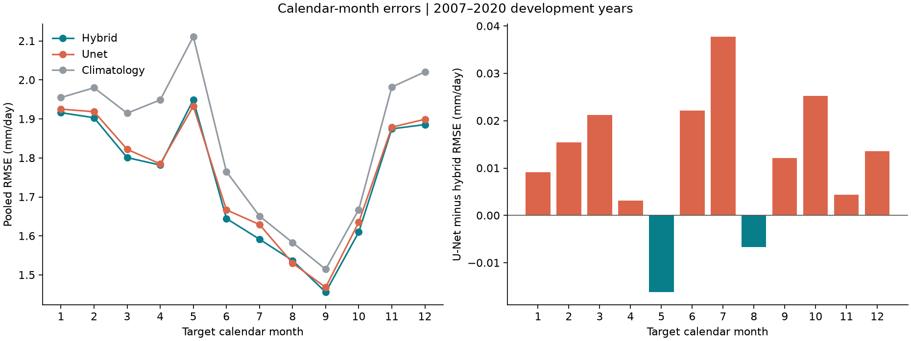
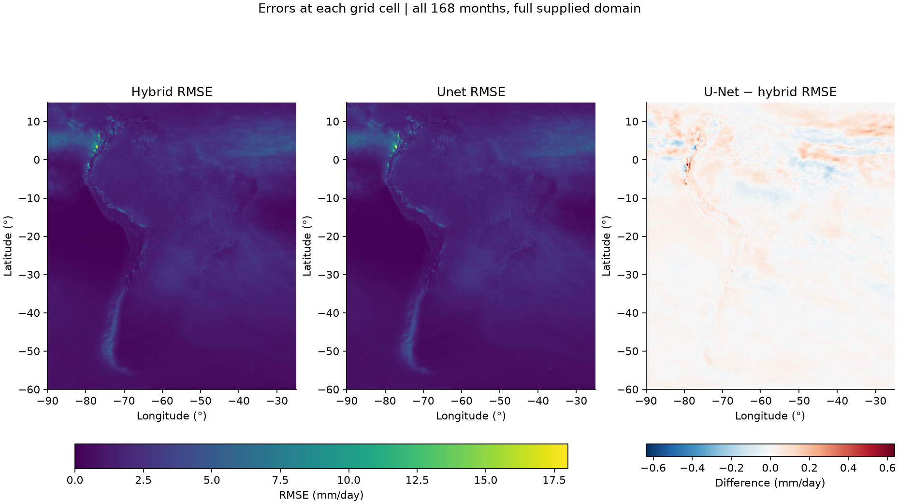
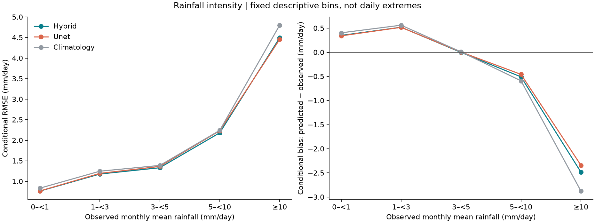
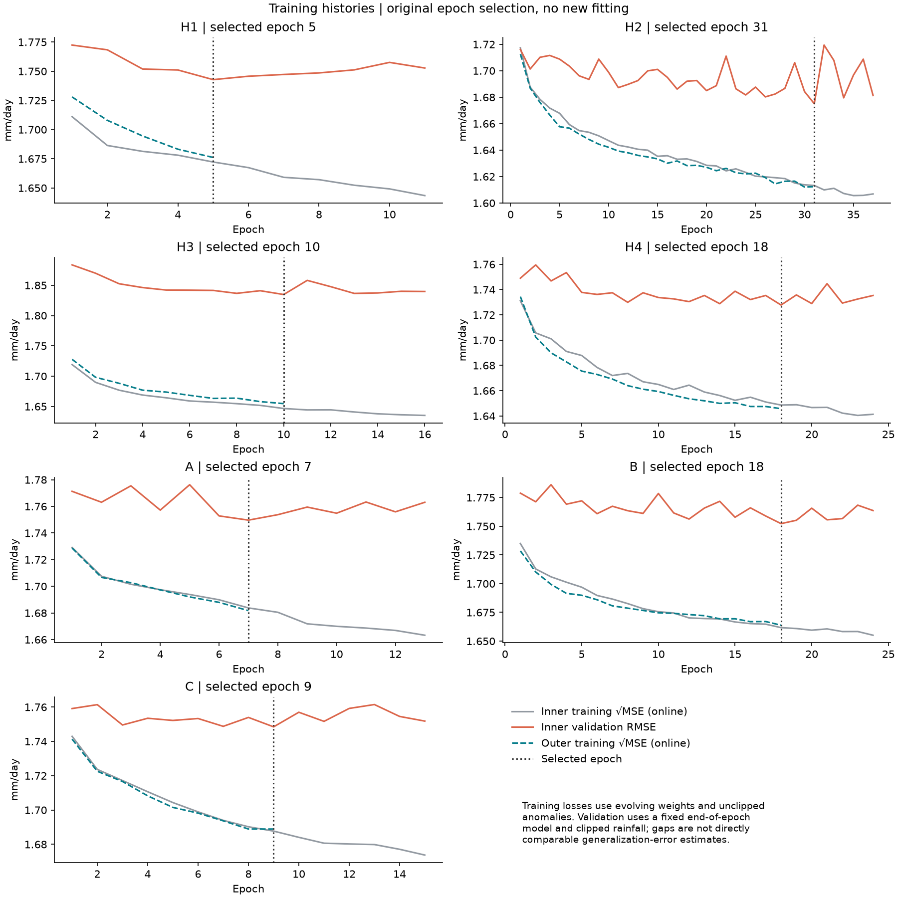

# Diagnosing the archived rainfall forecasts

This analysis describes where the fixed hybrid and the compact U-Net differ. It reads their existing seven-block predictions, the original observed rainfall and the saved training histories. It does not train, recalibrate, blend or promote a model.

The evaluation covers **168 months, January 2007–December 2020**, on the full supplied 301 × 261 grid. These are previously consulted development years, not an independent holdout. The grid includes ocean cells; the results and map percentages are not land-only or country-level estimates.

## Findings

The recomputed RMSE is **1.753399 mm/day for the hybrid** and **1.764726 mm/day for the U-Net**, matching the archived run. The U-Net loses 0.011327 mm/day overall and in all seven two-year blocks. The [complete comparison](../spatial_unet/RESULTS.md) records the original protocol and overall scores.

### Calendar month

The U-Net improves pooled RMSE in May (−0.016187 mm/day) and August (−0.006719). It worsens in the other ten calendar months, most in July (+0.037770), October (+0.025212) and June (+0.022106). MAE worsens in all twelve months, including May and August. Each calendar-month result pools all fourteen years rather than averaging fourteen RMSEs.

These are descriptive findings after looking at the results. They do not justify choosing a different model for each calendar month without a separate selection and evaluation procedure.



### Location

The U-Net has lower RMSE in **26.50% of grid cells** and higher RMSE in **73.50%**, using the same 168 months in every cell. This is a count of grid cells, not a percentage of geographic area, and it does not measure statistical significance.

| Latitude band | Hybrid RMSE | U-Net RMSE | U-Net − hybrid |
|---|---:|---:|---:|
| South of 35°S | 1.067389 | 1.074394 | +0.007005 |
| 35°S to below 15°S | 1.561323 | 1.568313 | +0.006990 |
| 15°S and northward | 2.257121 | 2.273074 | +0.015952 |

The northern band contributes **72.90% of the net extra squared error** of the U-Net. This is an additive error attribution, influenced by both sample count and rainfall variability; it is not a causal explanation or an area-weighted percentage.



The first two panels use a shared color scale. Blue in the difference panel favors the U-Net; red favors the hybrid. Full-resolution RMSE, MAE and bias maps are written to `error_maps.nc` when the diagnostic is run. No border or land mask was added.

### Observed rainfall intensity

The bins below were fixed before calculating this diagnostic. They describe **monthly mean rainfall in mm/day**, not individual daily events or an extreme-event classification.

| Observed monthly mean | Grid-point/month pairs | Hybrid RMSE | U-Net RMSE | Difference |
|---|---:|---:|---:|---:|
| 0 to <1 mm/day | 3,652,555 | 0.764085 | 0.767254 | +0.003169 |
| 1 to <3 mm/day | 4,082,284 | 1.179268 | 1.195088 | +0.015820 |
| 3 to <5 mm/day | 2,456,739 | 1.332450 | 1.364274 | +0.031824 |
| 5 to <10 mm/day | 2,094,342 | 2.182150 | 2.232727 | +0.050578 |
| At least 10 mm/day | 912,328 | 4.494885 | 4.455254 | −0.039631 |

The largest positive contribution to the overall MSE difference comes from 5–<10 mm/day. The U-Net loses in this bin in six of seven blocks, and in 3–<5 mm/day in all seven. It improves in the ≥10 mm/day bin in five of seven blocks. That improvement partly offsets losses elsewhere but does not reverse the overall result.

Both models predict too little on average within the ≥10 bin: conditional bias is −2.484190 for the hybrid and −2.342179 mm/day for the U-Net. These groups are defined by the **observed outcome**, which would be unknown when issuing a forecast. The pattern is therefore a diagnostic, not an operational switching rule. Conditioning on observations also introduces regression-to-the-mean effects; it does not by itself establish a calibration defect or the cause of underperformance.



### Training histories

The original inner validation selected 5, 31, 10, 18, 7, 18 and 9 epochs for H1 through C. All runs stopped after six epochs without an improvement, before the 40-epoch ceiling. Each outer refit used exactly its selected epoch count.

Training loss generally decreases while inner validation improvement becomes limited or oscillates. H2 is especially variable. This is consistent with limited generalization and noisy epoch selection, but does not identify the cause. It provides no evidence that simply increasing the epoch limit would solve the problem.

Training curves are online losses on anomalies, measured while the weights change. Validation uses the fixed end-of-epoch model and nonnegative reconstructed rainfall. Their numerical gap is not an exact train-versus-validation generalization gap. Outer training curves also use a later training period. No outer validation curve was used to choose epochs.



## Reproduce the analysis

Use the official `treino_tp.nc` and download the saved output of the private [Kaggle run, version 2](https://www.kaggle.com/code/houxie/worcap-spatial-u-net-research/output?scriptVersionId=353775129). Its `spatial_unet/results` directory contains `H1/predictions.nc` through `C/predictions.nc`. Only those seven maps are needed from the large output archive. Do not execute code extracted from the archive for this analysis.

From the repository root:

```bash
python -m pip install -r research/diagnostics/requirements.txt
python -m unittest research.diagnostics.test_diagnostics -v
python -m research.diagnostics.analyze_errors \
  --predictions /path/to/spatial_unet/results \
  --observations /path/to/official/treino_tp.nc \
  --output /path/to/new/diagnostic_report
```

Use one line instead of the backslash continuations in PowerShell. Choose a new output directory: existing reports are never overwritten. These dependencies are for this read-only analysis; use the model's separate pinned environment to fit or reproduce forecasts.

The command produces pooled metrics by month, latitude band, band × month, intensity and block × intensity; paired differences and additive MSE contributions; training summaries; four figures; pixel-level NetCDF maps; and verification metadata. A group with no samples has undefined metrics, rather than an invented zero error. Signed bias always means prediction minus observation.

## Verification and evidence

- The original observation file and all seven prediction files match the hashes of the archived run.
- Forecast dates, units and coordinates are checked exactly. Observations are `tp[T]`; the already shifted `tp_alvo` file is not used.
- All **2,016 monthly model × region error records** were reproduced from the maps, including count, squared error, absolute error and signed error sums.
- Global RMSE matched the original reports within 1e-12. Intensity bins partition the complete evaluation, and their counts and error sums reproduce the global totals.
- Inner selected epochs match the minimum saved inner RMSE and the length of each outer refit history.
- Five synthetic tests cover pooled RMSE, intensity boundaries, empty bins, shifted dates/flipped coordinates and changed file hashes.

Small CSV/JSON artifacts are retained in [evidence](evidence), with [summary](evidence/summary.json), [verification metadata](evidence/verification.json), [calendar comparisons](evidence/calendar_comparison.csv), [regional comparisons](evidence/region_comparison.csv), [intensity comparisons](evidence/intensity_comparison.csv) and [training summaries](evidence/training.csv). The verification manifest also hashes the generated figures and `error_maps.nc`; the NetCDF is reproducible from the command above and is kept outside Git with the larger inputs. Figures are in `assets/`.

## Decision and next step

Keep the hybrid as the reference. The U-Net has useful local and high-rainfall improvements, but the current experiment does not support replacing the hybrid or choosing a blend from these findings. The two methods share input information and evaluation dates, but their training samples differ: full monthly maps for the U-Net versus sampled grid points for the trees.

The next step is to consolidate configuration, run identifiers, saved forecasts, checks and these diagnostics into the common evaluation workflow. That makes the next hypothesis test reviewable before any model change. The prospective source gate remains separate: incomplete or unverified CFSv2 inputs must still block issuance, without blocking historical analysis.
