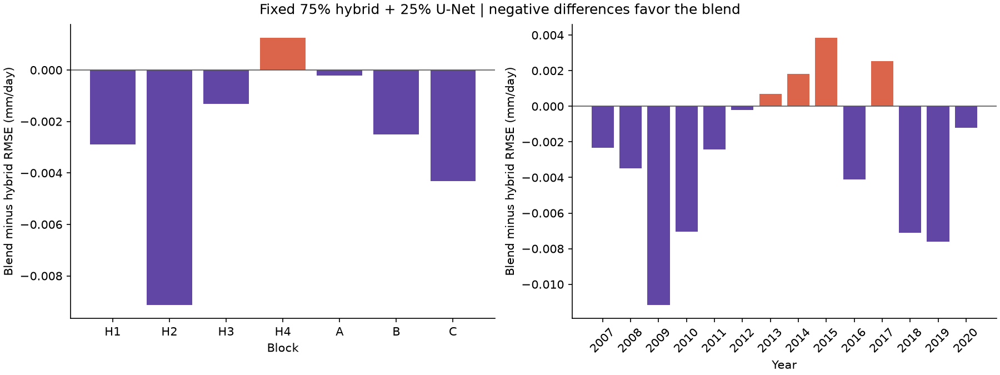
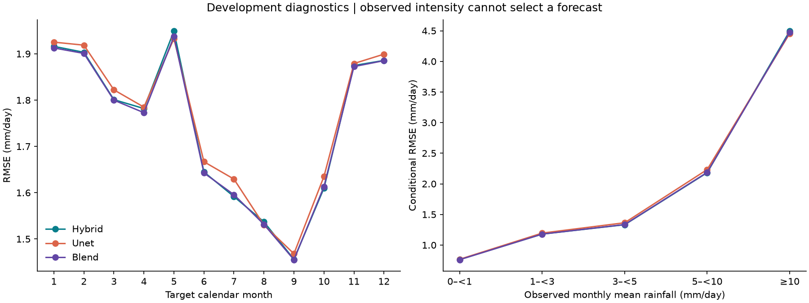
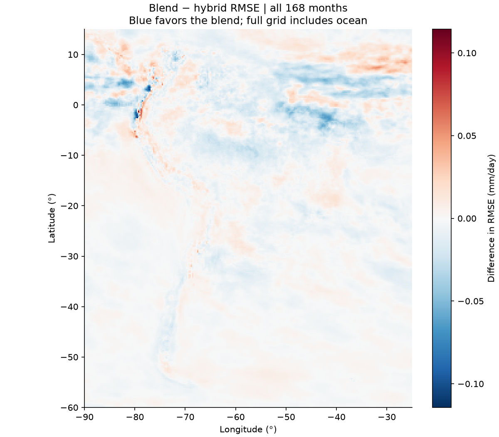

# A fixed hybrid / U-Net combination

This experiment asks whether the compact U-Net adds useful information to the hybrid even though it has a higher RMSE on its own. The single candidate is:

```text
rainfall = 0.75 × archived hybrid rainfall + 0.25 × archived U-Net rainfall
```

The weights were chosen before evaluating this combination, after looking at the component models' diagnostics. The 2007–2020 years are therefore development data. This is not an independent holdout or a claim about future skill.

The [protocol](protocol.json) fixes the weights, seven blocks, arithmetic and comparisons. Both inputs are the final nonnegative rainfall maps, in mm/day. Computation and candidate storage use float64. There is no additional clipping, calibration, weight search, regional switching, new training or source download. Observed-intensity groups describe errors after the event; they cannot choose an operational forecast.

## Reproduce

Use the [common evaluation workflow](../workflow/README.md) and copy [blend.example.json](../workflow/blend.example.json), changing only file paths and the run name/output folder. It needs the official `treino_tp.nc` and the same seven archived prediction maps as the original diagnostic.

```bash
python -m unittest research.fixed_blend.test_blend research.workflow.test_workflow research.diagnostics.test_diagnostics -v
python -m research.workflow run --config /path/to/blend_config.json
python -m research.workflow verify --run /path/to/completed_run
```

For Kaggle, import the updated [workflow notebook](../workflow/experiment_workflow.ipynb), set `EXPERIMENT = "fixed_blend_v1"` and leave `MODE = "saved"`. Attach the complete saved prediction output, not just its reports. No GPU is needed.

## Checks and outputs

The original diagnostic runs first, reproducing all source-model metrics and verifying dates, coordinates, units, hashes and epoch selection. The new adapter saves the blend maps for every block and checks an exact float64 readback. It computes RMSE, MAE and signed bias globally, by block, year, calendar month, latitude band and observed rainfall intensity, plus pixel-level error maps. Counts and error sums must reproduce the pooled totals.

The paired error products verify both equivalent MSE identities for the fixed blend. Error correlation is reported descriptively; no best weight is estimated. Spatial and temporal dependence prevents treating millions of grid cells as independent evidence.

Each workflow run preserves its source/configuration snapshot, protocol, candidate predictions, comparisons, figures, HTML report and output manifest. Candidate maps and observations stay outside Git. The operational hybrid, source-availability gate and original archived predictions are unchanged.

## Result: 29 September 2026

The complete local evaluation covered 168 months and 13,198,248 grid-point/month pairs. Both source models' archived scores reproduced. The single fixed blend improved global RMSE and MAE, with a worse global absolute bias.

| Model | RMSE | MAE | Signed bias |
|---|---:|---:|---:|
| Hybrid reference | 1.753399 | 1.047213 | +0.004916 |
| U-Net alone | 1.764726 | 1.060313 | +0.021218 |
| Fixed 75% hybrid + 25% U-Net | **1.750628** | **1.046128** | +0.008992 |

Units: mm/day. RMSE decreased by **0.002771 mm/day (0.1580%)**. The blend improved RMSE in **6/7 blocks**, **10/14 years**, **10/12 calendar months**, all three latitude bands and **56.99% of grid cells**. These percentages are descriptive, not significance or area-weighted estimates.



H4 (2013–2014) worsened by 0.001256 mm/day. The four worse years were 2013, 2014, 2015 and 2017. MAE worsened in H4, A and B despite the overall improvement. The largest block gain was H2: −0.009142 mm/day. Calendar-month RMSE worsened in July and October.

The blend improved RMSE in the 0–<1, 1–<3 and ≥10 mm/day observed monthly-mean bins, but worsened in 3–<5 and 5–<10. Much of the net error reduction came from the ≥10 group. This finding does not justify selecting the model using future observed intensity.





Pooled centered forecast-error correlation was **0.983109**. Although the errors were highly correlated, the exact fixed-blend MSE identity confirmed sufficient disagreement to reduce this development RMSE. No alternative weights or optimized weight were evaluated.

## Decision

Keep the fixed blend as a **research candidate** and preserve the operational hybrid. The result supports investigating U-Net complementarity; it does not establish future improvement or remove the bias/medium-rainfall tradeoffs. Before operational adoption, freeze the same candidate and evaluate genuinely unconsulted outcomes or prospective months. Any new architecture or correction model is a separate experiment, not part of this result.

The [additional chronological evaluation in 2021–2022](../temporal_extension/RESULTS.md) is complete, using a new fit ending in September 2020. The same fixed blend reduced pooled RMSE by 0.0832%, but worsened MAE, absolute bias and the second year's RMSE. It remains a research candidate. Because those observations participated in earlier final training, the extension is explicitly retrospective and does not replace the need for prospective confirmation.

Seventeen configuration, diagnostic and blend tests passed. All candidate NetCDF maps were read back exactly, original model sums were reproduced, intensity bins partitioned the complete sample, and both MSE identities matched the direct calculation. The workflow verified the complete run inventory. No model fitting, new download or Kaggle execution was needed.

The [validation record](evidence/validation.json), [summary](evidence/summary.json), [overall metrics](evidence/global.csv), [block comparison](evidence/blocks_comparison.csv), [year comparison](evidence/years_comparison.csv) and [error products](evidence/complementarity.json) preserve the small audit artifacts. Large candidate maps and the complete local run remain outside Git.
