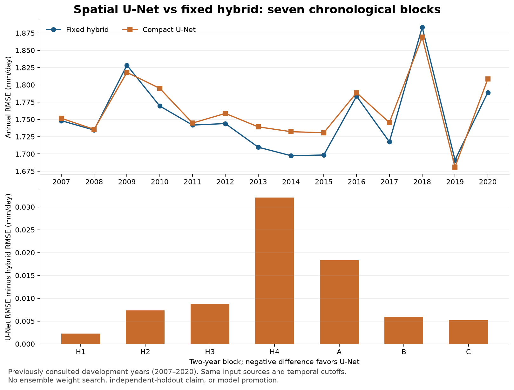

# Seven-block spatial comparison

The fixed hybrid remains the research baseline. The compact U-Net completed all seven chronological blocks with the unchanged `spatial_unet_v1` protocol and had higher RMSE in every block. No neural model was promoted and no prospective forecast was issued.

These are development results on January 2007–December 2020, years already consulted during earlier research. They do not estimate performance on an independent holdout or establish skill in future years.

## Overall result

| Model | RMSE | MAE | Bias | Area-weighted RMSE |
|---|---:|---:|---:|---:|
| Monthly climatology | 1.850645 | 1.100536 | -0.005280 | 1.938385 |
| Fixed hybrid | **1.753399** | **1.047213** | **+0.004916** | **1.832106** |
| Compact U-Net | 1.764726 | 1.060313 | +0.021218 | 1.843936 |

Units are mm/day. Each model was evaluated on the same 168 months and 13,198,248 grid-point/month pairs. The global RMSE is calculated from pooled squared errors, not by averaging block RMSEs.

U-Net RMSE increased by **0.011327 mm/day (0.646%)** relative to the hybrid. MAE, absolute global bias and area-weighted RMSE also worsened. The U-Net beat monthly climatology overall, but did not outperform the stronger hybrid reference.

## Temporal and regional consistency

| Block | Evaluation years | Hybrid RMSE | U-Net RMSE | Difference | Selected epochs |
|---|---|---:|---:|---:|---:|
| H1 | 2007–2008 | 1.741364 | 1.743602 | +0.002238 | 5 |
| H2 | 2009–2010 | 1.799138 | 1.806511 | +0.007373 | 31 |
| H3 | 2011–2012 | 1.742856 | 1.751665 | +0.008809 | 10 |
| H4 | 2013–2014 | 1.703644 | 1.735707 | +0.032063 | 18 |
| A | 2015–2016 | 1.741522 | 1.759822 | +0.018300 | 7 |
| B | 2017–2018 | 1.802322 | 1.808263 | +0.005942 | 18 |
| C | 2019–2020 | 1.740802 | 1.745958 | +0.005157 | 9 |

Difference means U-Net minus hybrid; positive values favor the hybrid. Epoch counts were selected by the prespecified inner chronological validation, followed by a fresh outer fit. They were not chosen from these evaluation scores.

The U-Net improved RMSE in **3 of 14 individual years**: 2009, 2018 and 2019. It worsened in the other 11 years and in all three latitude bands used by the regional diagnostic. The largest block loss occurred in 2013–2014. This does not establish why the network underperformed. The subsequent [archived-map diagnostic](../diagnostics/README.md) examines spatial errors, calendar months, rainfall intensity and training curves without changing this experiment.

## What stayed fixed

The network uses 31 input channels on the 301 × 261 grid, 122,945 parameters, and the same source information and temporal cutoffs as the hybrid: atmosphere T−4, ocean indices T−3, seasonal initialization T−1 and training rainfall T−4. No additional SST principal components were introduced.

Architecture, seed 42, AdamW settings, batch size, maximum 40 epochs and patience of six remained unchanged after the H1 pilot. Preprocessing was refitted within each training split; the training rainfall reference excludes the target monthly map. See the [protocol](protocol.json) and [implementation notes](README.md).

The models share evaluation dates and grid points, but not identical training samples or compute: the U-Net learns from complete monthly maps, while the tree models sample 5,000 pixels per month. This comparison therefore evaluates the two training approaches as implemented, rather than an architecture-only ablation.

## Execution and verification

The run completed on Kaggle on 29 September 2026 (UTC), using Python 3.12.13, NumPy 2.0.2, pandas 2.3.3, xarray 2025.12.0, LightGBM 4.6.0 and PyTorch 2.10.0+cu128 on one Tesla T4. The source, protocol, input and environment signature exactly matches the [H1 pilot](PILOT_RESULTS.md).

- All seven hybrid controls reproduced archived RMSE, MAE and bias within the prespecified 1e-6 tolerance before neural fitting.
- H1 was rerun because the new Kaggle session did not contain the live pilot cache. Its U-Net RMSE reproduced the pilot exactly.
- The eight spatial synthetic checks passed again in the Kaggle environment.
- All 77 block report artifacts included in the JSON/CSV export matched their completed-run hashes. The full run signature matched the pilot signature.
- Global, block, annual and regional RMSE, MAE, bias and area-weighted RMSE were independently recomputed from the exported monthly error sums.
- After training, a duplicated pilot-only call in the notebook cell was removed. The seven-block summary was regenerated from the hash-verified completed blocks, without refitting or changing predictions.

Full-precision [global scores](evidence/seven_blocks/global.csv), [block scores](evidence/seven_blocks/blocks.csv), [annual scores](evidence/seven_blocks/years.csv), [regional scores](evidence/seven_blocks/regions.csv), [monthly statistics](evidence/seven_blocks/monthly_metrics.csv), [run signature](evidence/seven_blocks/signature.json) and [export verification](evidence/seven_blocks/export_verification.json) are preserved. Each block directory includes its source calendar, split dates and inner/outer training histories.

The private [Kaggle notebook, version 2](https://www.kaggle.com/code/houxie/worcap-spatial-u-net-research?scriptVersionId=353775129) preserves the complete run as **Seven blocks - fixed chronological U-Net protocol**, including model weights and prediction maps among its 230 output files. Those larger binary outputs are retained in Kaggle rather than committed to Git. The repository stores the smaller JSON/CSV evidence. The GPU session was stopped after the saved output was verified.

## Decision

Keep the fixed hybrid as the reference and retain this U-Net as a documented experiment. This result does not justify a larger network or a tuned blend by itself. Any follow-up should state a specific hypothesis before training and preserve a separate evaluation process for future months.
