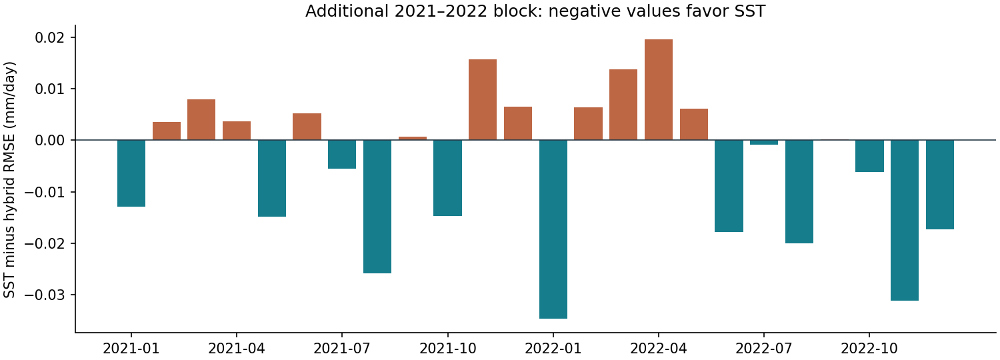

# SST temporal extension: a small improvement, with remaining bias

The fixed SST experiment completed the full January 2021–December 2022 block. `complete_extension` is true, and the reference model reproduces all four archived global metrics exactly. `complete_seven_blocks: false` is expected: this run evaluates one additional block, without repeating the original seven.

## Paired results

| Model | RMSE | MAE | Signed bias | Area-weighted RMSE |
|---|---:|---:|---:|---:|
| Reference model | 1.796784 | 1.090174 | +0.128184 | 1.883642 |
| Reference model + 8 SST PCs | 1.792633 | 1.087497 | +0.136450 | 1.879225 |

Units: mm/day. SST reduces RMSE by **0.004150 (0.2310%)** and MAE by **0.002677**, while increasing signed and absolute global bias by **0.008267**. Both models overpredict rainfall on average.

| Year | Reference model RMSE | SST RMSE | SST minus reference model |
|---|---:|---:|---:|
| 2021 | 1.752413 | 1.750696 | −0.001717 |
| 2022 | 1.840085 | 1.833612 | −0.006472 |

MAE also improves in both years. Bias worsens in 2021 and improves in 2022. Monthly RMSE improves in **12 of 24 months**, and worsens in the other 12. The largest improvement occurs in January 2022 (−0.034738); the largest deterioration occurs in April 2022 (+0.019693).

Regional RMSE improves north of 15°S (−0.004685) and between 35°S and 15°S (−0.008276), but worsens south of 35°S (+0.001513). These latitude bands summarize heterogeneous areas; they do not establish skill at every location.

## Context across the existing history

Combining error sums from the previously completed 2007–2020 comparison with this extension gives a descriptive 2007–2022 view. This is pooling disjoint evaluation months, not averaging fold RMSE values or running another fit.

| Model | Pooled RMSE | Pooled MAE | Pooled signed bias |
|---|---:|---:|---:|
| Reference model | 1.758880 | 1.052583 | +0.020325 |
| Reference model + SST | 1.757795 | 1.053517 | +0.032121 |

Across this history, SST improves pooled RMSE by approximately **0.0617%**, but worsens MAE and absolute global bias. It improves **7 of 8 two-year blocks** and **8 of 16 individual years**. All these periods have been consulted in development; none is a new independent test of future performance.

The SST candidate's RMSE in 2021–2022 is also lower than the archived fixed reference model/U-Net blend (1.795289), while the earlier 2007–2020 blend remains better than SST on RMSE. There is no basis for declaring one candidate uniformly better across the history.

## Execution and verification

- Four LightGBM fits, one shared local ridge, eight SST PCs, unchanged weights, source lags and training samples. No neural fits or parameter search.
- Recorded fit/prediction routine: **187.36 seconds**. This excludes input checks/loading and the subsequent scoring cell.
- Training targets: October 1990–September 2020. PCA fitting origins: August 1990–July 2020. Source calendars match atmosphere T−4, indices T−3, SST T−2 and seasonal initialization T−1.
- The sample hash matches the earlier baseline. Both reference model and climatology metrics match the archived extension exactly. Recorded freezing precedes evaluation-label opening.
- Verified 20 included frozen-artifact hashes, 9 evaluation-file hashes and 11 source-file hashes. Source text matches the prepared notebook. Global, annual, regional and calendar metrics were recomputed from the monthly error sums.
- The report ZIP omits 12 referenced files: models, PCA arrays, sampled pixels, climatologies and prediction maps. Their hashes could not be checked against absent files, and raw observations were not independently rescored. Recorded source dates do not establish historical publication vintages.

Input ZIP SHA-256: `b1ff79262dc3f08b295c2e7c2b40edf21d131b7008fbbe05b7fd5003bb5e9aaa`. The retained report subset and verification record are under `evidence/completed_20260930/`. Full maps and model artifacts should remain in the saved Kaggle output.

## Decision

Keep SST as a research candidate; do not replace the current forecasting model. The additional block supports a modest, uneven contribution from SST, with unresolved overprediction and mixed longer-history metrics.

A subsequent bounded comparison can combine the SST model with the existing U-Net at the already fixed 75/25 ratio and compare it with the current reference model/U-Net blend. That comparison needs aligned prediction maps; aggregate scores cannot determine the blend's error. Use saved maps where available, retain the same chronological protocol, and do not choose new weights from the 2021–2022 result.
