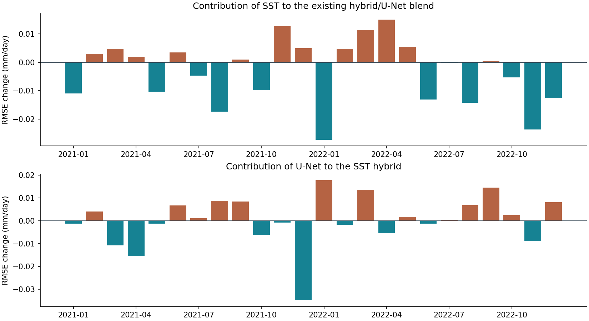

# Fixed SST/U-Net blend: small RMSE gain, mixed added value

The January 2021–December 2022 comparison completed successfully. `complete_comparison` is true; `complete_seven_blocks: false` is expected for this single 24-month extension. No model was fitted and no weight was searched. The recorded comparison routine took 8.27 seconds, excluding the preceding synthetic checks and input-discovery cell.

## Results

Both blends use 75% reference model and 25% of the same saved U-Net. The candidate replaces only the reference model component with its eight-PC SST version.

| Model | RMSE | MAE | Signed bias |
|---|---:|---:|---:|
| Original reference model | 1.796784 | 1.090174 | +0.128184 |
| Original reference model + U-Net | 1.795289 | 1.092756 | +0.146153 |
| SST model | 1.792633 | **1.087497** | +0.136450 |
| SST model + U-Net | **1.792304** | 1.090812 | +0.152353 |

Units: mm/day. Against the original blend, the candidate reduces RMSE by **0.002984 (0.1662%)** and MAE by 0.001944, while increasing absolute bias by 0.006200. RMSE improves in both annual aggregates, with 12 monthly improvements and 12 deteriorations. Regional RMSE improves north of 15°S and between 35°S and 15°S, but worsens south of 35°S.

Against the **SST model alone**, adding the U-Net reduces pooled RMSE by only **0.000329 (0.0184%)**, worsens MAE by **0.003315**, and increases absolute bias by **0.015902**. Both models overpredict on average.

| Year | SST model RMSE | SST model + U-Net RMSE | Change after adding U-Net |
|---|---:|---:|---:|
| 2021 | 1.750696 | 1.746164 | −0.004532 |
| 2022 | 1.833612 | 1.837286 | +0.003674 |

The candidate improves on the SST model in 11 of 24 months and worsens in 13. The centered SST model/U-Net error correlation is 0.9891 across pooled grid-month observations. This is descriptive evidence of similar errors, not an independence assumption or significance test.

## Verification and limits

Verified 24 included artifact hashes and all 11 bundled source/reference files against the prepared local source. Recomputed global, annual, monthly, regional and calendar aggregates from the monthly error sums, all reported win counts and score differences, and the fixed-blend squared-error identities. The source receipts reproduce the archived metrics within floating-point tolerance. The run records identical reference model and climatology maps between the two source experiments.

The small ZIP excludes `predictions.nc` and the original inputs. Their actual bytes were not rehashed locally, and raw observations were not independently rescored. The verification is of report consistency and included artifacts. These years were previously consulted; historical publication vintages remain unverified. This result does not demonstrate improved forecasting in future years.

Archive SHA-256: `a392124c8576acd3302074dc558fdbe4f68426b89c45832c896c7a377f651033`. A report subset and local verification record are retained in `evidence/completed_20260930/`; the original archive also includes the source snapshot.

## Decision

Retain both SST candidates for research and keep the current forecasting model unchanged. The SST contribution persists in the existing blend, but this block gives little evidence for a useful additional contribution from the current U-Net once SST is present.

Before another expensive neural fit, check availability of the saved SST and U-Net maps for the original seven blocks. If preserved, apply this same fixed comparison without retraining and assess pooled error sums, annual behavior, MAE and bias. Do not choose new blend weights or region-specific switches from the consulted 2021–2022 results.
