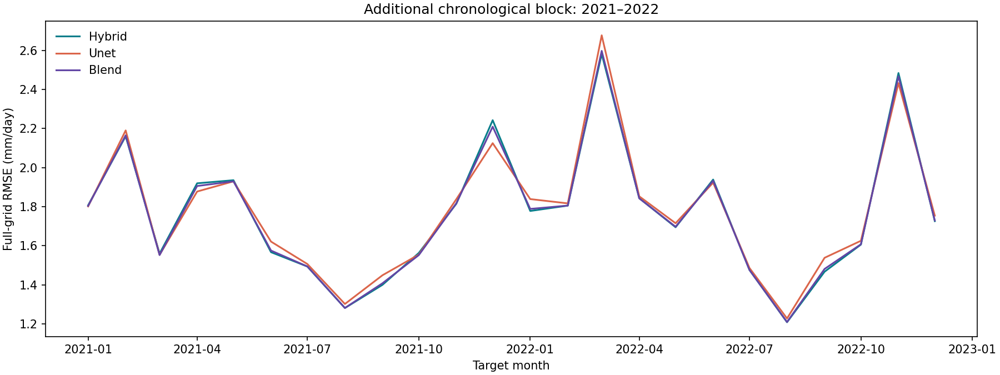

# Reference model / U-Net: the 2021–2022 result

The [Kaggle run](https://www.kaggle.com/code/houxie/worcap-hybrid-and-u-net-temporal-extension/output?scriptVersionId=354026629) completed successfully in **733.9 seconds** on 29 September 2026 (Brasília time). All sixteen synthetic checks and the real-data input checks passed before fitting. The unchanged protocol refitted each model on October 1990–September 2020 and evaluated 24 monthly maps. The inner validation selected eight neural epochs; the final U-Net was initialized again and fitted for those eight epochs.

## Pooled result

| Model | RMSE | MAE | Signed bias |
|---|---:|---:|---:|
| Reference model | 1.796784 | **1.090174** | +0.128184 |
| U-Net alone | 1.806775 | 1.113652 | +0.200060 |
| Fixed 75% reference model + 25% U-Net | **1.795289** | 1.092756 | +0.146153 |
| Climatology | 1.876149 | 1.131244 | +0.049464 |

Units are mm/day. Scores cover the full supplied grid, including ocean, with **1,885,464 grid-point/month pairs**. The primary unweighted RMSE decreased by **0.001495 mm/day (0.0832%)**. Area-weighted RMSE also decreased, from 1.883642 to 1.881918. However, MAE increased by 0.002582 and absolute bias by 0.017969 mm/day. Positive bias means average overprediction.

These metrics describe different tradeoffs: a slightly lower squared-error aggregate does not mean the blend improves most months or typical absolute error. Grid cells and consecutive months are dependent; the sample count is not a count of independent forecasts.

## Stability across time and location

| Year | Reference model RMSE | Blend RMSE | Blend minus reference model |
|---|---:|---:|---:|
| 2021 | 1.752413 | 1.747350 | −0.005063 |
| 2022 | 1.840085 | 1.841980 | +0.001895 |

The blend improved RMSE in **10 of 24 individual months** and worsened it in 14. The largest improvement was December 2021 (−0.033231 mm/day); the largest loss was March 2022 (+0.016128). Both annual MAEs and absolute biases worsened.

The latitude-band comparison improved north of and including 15°S (−0.003641 mm/day) and worsened in both bands farther south (+0.000856 between 35°S and 15°S; +0.001052 south of 35°S). These bands include ocean and should not be described as country-level skill.

Calendar-month comparisons pool only two observations of each month. They are descriptive diagnostics, not a basis for choosing different model weights by season.

## Interpretation and next hypothesis

This adds evidence of limited complementarity: the U-Net has worse pooled RMSE on its own, but its fixed contribution slightly reduces the reference model's pooled RMSE. The small aggregate gain coexists with a worse second year, MAE and wet bias. **Keep the blend as a research candidate and retain the current forecasting model.** There is no automatic promotion or issued live forecast.

A useful next experiment is a modest, regularized bias correction for the neural contribution. Its correction must be estimated from temporally out-of-sample predictions within each training window, with its form and comparison fixed before evaluation. The observed 2021–2022 bias must not be subtracted directly from these predictions and then presented as a new validation gain. No correction, alternate weight search or new training has been performed as part of this review.

This period remains an **additional retrospective chronological evaluation**, not an untouched independent holdout: earlier final models had already used these years. Consolidated input snapshots also do not establish historical publication vintages. Generalization to future months still requires prospectively frozen predictions with verified source arrival times.

## Evidence and checks

- [Original global metrics](evidence/kaggle_354026629/evaluation/global.csv), [annual metrics](evidence/kaggle_354026629/evaluation/years.csv), [regional metrics](evidence/kaggle_354026629/evaluation/regions.csv), and [HTML report](evidence/kaggle_354026629/evaluation/report.html).
- [Inner training history](evidence/kaggle_354026629/inner/training_history.json) and [final training history](evidence/kaggle_354026629/unet/training_history.json).
- [Frozen record](evidence/kaggle_354026629/frozen.json), [evaluation completion record](evidence/kaggle_354026629/evaluation/complete.json), and [local result verification](evidence/result_validation.json).

All nine evaluation-file hashes and fourteen frozen artifacts included in the report ZIP were verified locally. Pooled RMSE, MAE and bias were recomputed from monthly sums and matched. Nineteen source files matched the executed snapshot, allowing recorded line-ending normalization where necessary. The report ZIP omits model weights and prediction maps; its 35 omitted frozen artifacts were **not** independently verified locally. The Kaggle evaluation required verification of the complete frozen package before scoring. The full output remains in the saved Kaggle version.
